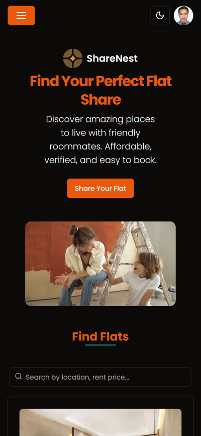

# ShareNest



[](https://room-share.vercel.app)
[](https://nextjs.org/)
[](https://tailwindcss.com/)
[](https://shadcn.dev/)

## Overview

**ShareNest** is an innovative platform where users can share their flats and book accommodations securely. The platform is built using the latest web technologies including Next.js, Tailwind CSS, and shadcn/ui, ensuring a seamless and modern user experience.

### Features

- **Secure Authentication:** Robust user authentication to ensure secure access and data privacy.
- **Flat Sharing:** Users can list their flats to share with others.
- **Flat Booking:** Easily book flats listed on the platform.
- **Responsive Design:** Fully responsive design for a great user experience on any device.

## Technology Stack

- **Next.js:** A powerful React framework for building server-side rendered and statically generated websites.
- **Tailwind CSS:** A utility-first CSS framework for rapidly building custom designs.
- **shadcn/ui:** A collection of reusable and customizable UI components.

## Getting Started

To get started with the development of ShareNest, follow these steps:

### Prerequisites

Make sure you have the following software installed:

- [Node.js](https://nodejs.org/) (v14 or later)
- [npm](https://www.npmjs.com/) or [Yarn](https://yarnpkg.com/)

### Installation

1. Clone the repository:

   ```bash
   git clone https://github.com/saifulaija/flat-share-client.git
   cd flat-share-client
